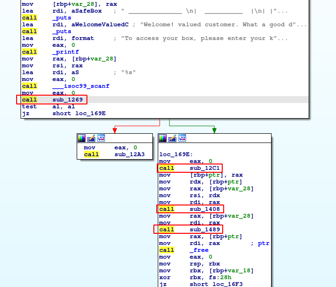
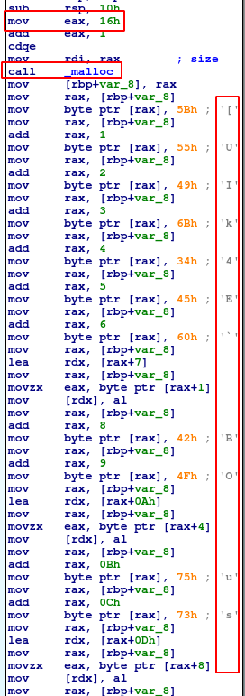
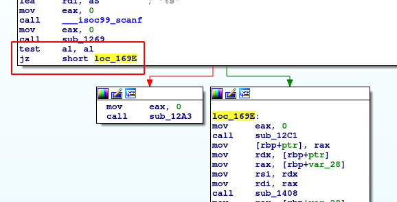

# [Safe Box]

## Introduction

This is a reversing challenge. The participants will have to reverse engineer the challenge file to figure out the key.        
This challenge involves debugging and disassembling the code, bypasssing anti-debugging technique, and reading assembly to understand key decryption and validation logic.

## Info for HTB

The challenge file is a simple 64-bit ELF file. It is built in C (~150 lines of code) and compiles with gcc. The challenge requires no connection, docker, VM, etc. Like almost all the other reversing challenges, the participants can play this challenge locally by simply by downloading the challenge file.


## Writeup

This challenge consists of a executable challenge file that takes a key input via stdin and constructs the flag out of it, if the key is correct. Below is a step-by-step approach of how one can go about solving this challenge.

- Starting out by disassembling the program and looking at the general flow and functions is a good first step. It can be noticed that after the welcome message is printed, there are a couple of functions, as shown in the image below.    
  <br>
  

- It is helpful to glance over these functions and get an idea about their general functionality.

  - _sub_1269 (anti_debug function):_ From the **ptrace** command, it becomes quite clear that this is an anti-debugging function. Based on the ptrace output, the program is branching and will exit if it is being debugged.
  - _sub_12C1 (build_key function):_ This function seems to be building a string, character by character. This string will be referred to as **pre-key** from here on now.
  - _sub_1408 (check_key function):_ This function takes in two inputs. It can be easily seen that one input is the input provided by the user via stdin, and the second is the **pre-key**. From this, it is quite a good guess that this function checks if the input key is correct.
  - sub_1489 (print_flag):_ This function contains the success message so it is easy to guess that this function builds & prints the flag.

  This is also a good place to notice that the failure message printed to stdout: `Oops! Seems like you have got the wrong key...` is a part of the _sub_12A3_ function. This function is being called at multiple places and after control reaches this function, the program exits. So this is the failure/exit function.

- The agenda seems clear now. One needs to simply recover the correct key which validates the _check_key_ function. Entering this key as the input should print the flag. Additionally, the pre-key seems to have a strong binding to the correct key. With this knowledge, one needs to do **two things - recover the pre-key and reverse engineer the validation logic in _check_key_ function.**

- **Recovering Pre-Key:** The _build_key_ function allocates 23 bytes for a string and builds it character by character. One can painstakingly trace the assembly and all recover the 22 characters. Alternatively, the program can be debugged to just capture the return value from this function since the return value is the pointer to the final string. Another method is to decompile this code and try to get the string via the deconstructed C code.  
  <br>
    
  <br>

  Debugging seems like the easiest approach. For this, one needs to bypass the anti-debugging logic in _anti_debug_ function. 
  There are various ways to bypass this anti-debugging technqiue, the easiest of which is change the return value from the _anti_debug_ function (change value of $rax to 0). This leads to the _ZF_ flag being set to True and the JZ condition becomes true as shown below.   
    <br>
    
  <br>

  The recovered string reads like this (in hex): `5B 55 49 6B 34 45 60 55 42 4F 34 75 73 42 75 64 4F 5B 33 75 49 6D`, and (in ASCII): `` [UIk4E`UBO4usBudO[3uIm ``

- **Validation Login:** The _check_key_ function checks the user input key against the decrypted pre-key. This check is done character by character. The logic for the decryption/validation is as follows:

```C
    for (int i = 0; i < input_key_length; i++) {
        if (input_key[i] != (0x10 ^ pre_key[i]) {
            // Validation Failed
        }
    }
    // Validation Passed
```

- Hence, the pre-key is being XORed with 0x10 character by character, the result of which is being compared to the input string. The correct input key is hence the pre-key XORed with 0x10. This comes out to be `4B 45 59 7B 24 55 70 45 52 5F 24 65 63 52 65 74 5F 4B 23 65 59 7D` or `KEY{$UpER_$ecRet_K#eY}` in ASCII. Enter this as the input key to retrieve the flag.

### Flag

HTB{Y()uR_M!LL!()N$$}

### Input

KEY{$UpER_$ecRet_K#eY}